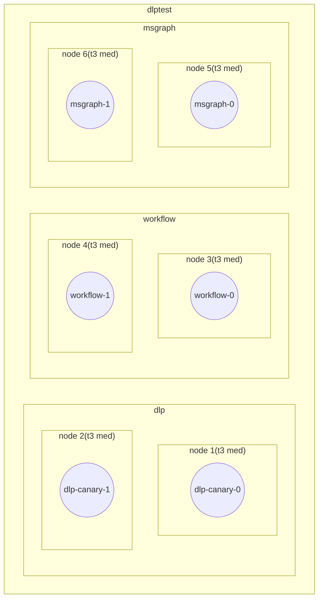
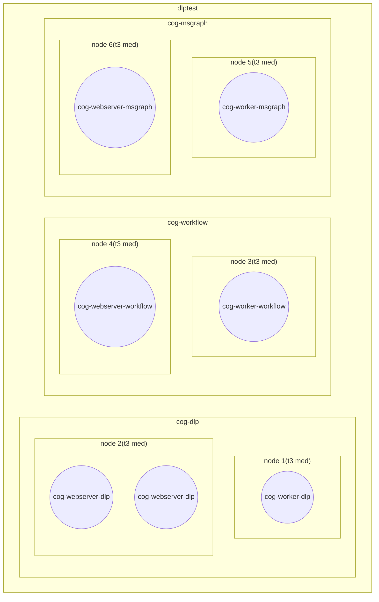

## Dev Cluster

```mermaid

 graph 
   subgraph dlptest
     subgraph dlp
       subgraph "node 1(t3 med)"
         id1((dlp-canary-0))
       end
       subgraph "node 2(t3 med)"
         id2((dlp-canary-1))
       end
     end
     subgraph workflow
       subgraph "node 3(t3 med)"
         id3((workflow-0))
       end
       subgraph "node 4(t3 med)"
         id4((workflow-1))
       end
     end
     subgraph msgraph
       subgraph "node 5(t3 med)"
         id5((msgraph-0))
       end
       subgraph "node 6(t3 med)"
         id6((msgraph-1))
       end
     end
   end

```

```mermaid

 graph 
   subgraph dlptest
     subgraph cog-dlp
       subgraph "node 1(t3 med)"
         id1((cog-worker-dlp))
       end
       subgraph "node 2(t3 med)"
         id2((cog-webserver-dlp))
         id3((cog-webserver-dlp))
       end
     end
     subgraph cog-workflow
       subgraph "node 3(t3 med)"
         id4((cog-worker-workflow))
       end
       subgraph "node 4(t3 med)"
         id5((cog-webserver-workflow))
       end
     end
     subgraph cog-msgraph
       subgraph "node 5(t3 med)"
         id6((cog-worker-msgraph))
       end
       subgraph "node 6(t3 med)"
         id7((cog-webserver-msgraph))
       end
     end
   end

```
