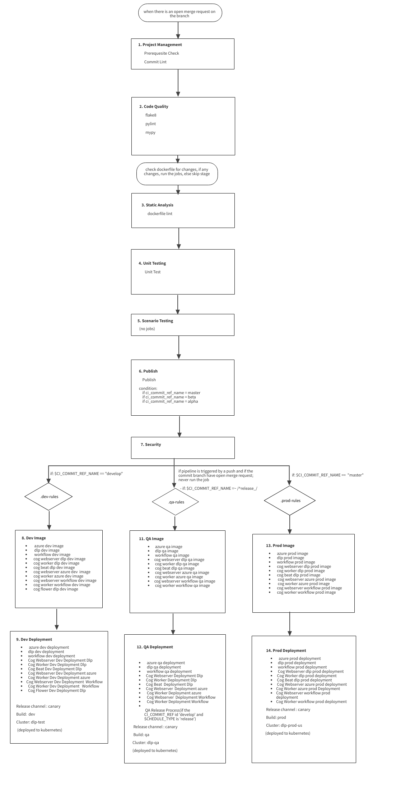

# DEPLOYMENT PROCESSS DOCUMENTATION 

## Purpose 

The purpose of this document is to give the overall view on the   whole deployment process which includes all the stages and will execute in the same order as they are mentioned. Details like how deployment happens, where it is deployed and triggers for the same are explained. The flowchart is also included to visualize the deployment process. 
## Scope 

This document explains the gitlab ci/cd deployment of apps called dlp,workflow and azure and their cog workers, cog webservers and cog beat. 
## Procedures: 

### Stages: 

   - Project Management   
   - Code Quality 
   - Static Analysis 
   - Unit Testing 
   - Scenario Testing 
   - Publish 
   - Security 
   - Dev Image 
   - Dev Deployment 
   - QA Image 
   - QA Deployment 
   - Prod Image 
   - Prod Deployment 

### 1. Project Management: 

      - Prerequisite Check:   Checks whether all the prerequisites for the pipeline is met. 
      - Commit Lint:   Checks all the commit messages and make sure they follow a set of rules. 
It runs only when there is an open merge request on the branch. 

### 2. Code Quality: 
    - flake8 
    - pylint 
    - mypy 
This stage ensures that the application code follows a specific format. And it runs only  when there is an open merge request on the branch

### 3. Static Analysis: 
     - dockerfile lint 
This job is currently disabled.

It is linter used for parsing the Dockerfile into an AST and performs rules on top of the AST 
This job runs  only when there are any changes in the dockerfile after an open merge request.

### 4. Unit Testing: 

     - Unit Test:  
This job is currently disabled.

This job does the unit testing and saves the artifatcs in a file called “unit_test.xml”. 

### 5. Scenario Testing: 
Currently no jobs are there in this stage. 

### 6. Publish: 
    - Publish: 
It creates the whole package release workflow including: determining the next version number, generating the release notes, and publishing the package based on the rule I.e the CI_COMMIT_REF_NAME is master/beta/alpha.  

### 7. Security: 
 - sast: 
 - .sast-analyzer: 
 - bandit-sast: 
 - brakeman-sast: 
 - eslint-sast: 
 - flawfinder-sast: 
 - kubesec-sast: 
 - gosec-sast: 
 - .mobsf-sast: 
 - mobsf-android-sast: 
 - mobsf-ios-sast: 
 - nodejs-scan-sast: 
 - phpcs-security-audit-sast: 
 - pmd-apex-sast: 
 - security-code-scan-sast: 
 - semgrep-sast: 
 - sobelow-sast: 
 - spotbugs-sast: 
It ensures multiple layers of security rules are enforced. 

### DEV 
The following steps will happen only when the branch or tag name for which project is built is “develop". There are 2 stages in the process i.e., Dev image and Dev deployment. 

     environment: 
       name: Dev 
       url:https://dlp-dev.mitsogo.com   

 #### 8. Dev Image:       
        variables: 
               RELEASE_CHANNEL: canary  
               BUILD: dev 
               CLUSTER: dlp-test 

(APP_NAME=dlp/azure/workflow) 
  - azure dev image 
  - dlp dev image 
  -  workflow dev image 

(PRIMARY_APP = dlp/azure/workflow,  
APP_NAME=cog_worker/cog_webserver/cog_beat/cog_flower) 
  - cog webserver dlp dev image 
  - cog worker dlp dev image 
  - cog beat dlp dev image 
  - cog webserver azure dev image 
  - cog worker azure dev image 
  - cog webserver workflow dev image 
  - cog worker workflow dev image 
  - .cog flower dlp dev image 

In this stage, we build a docker image based on the dockerfiles in. deployment folder and forms the image tag by using the above variables and pushes them to the registry as described in the “base.gitlab-ci.yml file” which references all the required arguments from the “utils.gitlab-ci.yml” file.The resulted image tags are given below: 

 dlp/azure/workflow:

     IMAGE_TAG="${CI_SERVER_HOST}:4567/dlp/server/${BUILD}:${RELEASE_CHANNEL}_${APP_NAME}_${CI_COMMIT_SHORT_SHA}" 

 cog_worker/cog_webserver/cog_beat/cog_flower:
 
     IMAGE_TAG="${CI_SERVER_HOST}:4567/dlp/server/${BUILD}:${RELEASE_CHANNEL}_${APP_NAME}_${PRIMARY_APP}_${CI_COMMIT_SHORT_SHA}" 

 And an .env file is also created to provide all the environment variables for the dockerfile and source apps. 

 #### 9. Dev deployment: 
 - azure dev deployment  
 - dlp dev deployment  
 - workflow dev deployment 
 - Cog Webserver Dev Deployment Dlp 
 - Cog Worker Dev Deployment Dlp 
 - Cog Beat Dev Deployment Dlp 
 - Cog Webserver Dev Deployment Ms Graph 
 - Cog Worker Dev Deployment Ms  Graph 
 - Cog Webserver Dev Deployment Workflow 
 - Cog Worker Dev Deployment   Workflow 
 - Cog Flower Dev Deployment Dlp 

In this stage, the path of the kubernetes files (DEPLOY_PATH) are determined and changes it’s <REGISTRY_URL>:<TAG> to the $< IMAGE_TAG> which we got from the previous stage.And it extends to k8.gitlab-ci.yml file which has instructions to set the cluster and its contexts which later deploys the kubernetes files. 

 dlp/azure/workflow:

     DEPLOY_PATH: .deployment/${APP_NAME}/${BUILD}_${RELEASE_CHANNEL}.yaml 

 cog_worker/cog_webserver/cog_beat/cog_flower: 

     DEPLOY_PATH: .deployment/${APP_NAME}/${PRIMARY_APP}/${BUILD}_${RELEASE_CHANNEL}.yaml 

### QA 
The following steps will not run if pipeline is triggered by a push and if the commit branch have open merge request and will run only when the branch or tag name for which project is built is a regex expression with “~/^release_/”. (The job QA Release Process is an exception to this rule.)There are 2 stages in the process i.e., QA image and QA deployment. 

     environment: 
       name:QA 
       url:https://dlp-qa.mitsogo.com   

#### 11. QA Image: 

        variables: 
               RELEASE_CHANNEL: canary  
               BUILD: qa 
               CLUSTER: dlp-qa 

  (APP_NAME=dlp/azure/workflow) 
  - azure qa image 
  - dlp qa image 
  - workflow qa image 

(PRIMARY_APP = dlp/azure/workflow,  
APP_NAME=cog_worker/cog_webserver/cog_beat) 
 - cog webserver dlp qa image 
 - cog worker dlp qa image 
 - cog beat dlp qa image 
 - cog webserver azure qa image 
 - cog worker azure qa image 
 - cog webserver workflow qa image 
 - cog worker workflow qa image 

In this stage, we build a docker image based on the dockerfiles in. deployment folder and forms the image tag by using the above variables and pushes them to the registry as described in the “base.gitlab-ci.yml file” which references all the required arguments from the “utils.gitlab-ci.yml” file.The resulted image tags are given below: 

dlp/azure/workflow:   

     IMAGE_TAG="${CI_SERVER_HOST}:4567/dlp/server/${BUILD}:${RELEASE_CHANNEL}_${APP_NAME}_${CI_COMMIT_SHORT_SHA}" 

cog_worker/cog_webserver/cog_beat/cog_flower: 

     IMAGE_TAG="${CI_SERVER_HOST}:4567/dlp/server/${BUILD}:${RELEASE_CHANNEL}_${APP_NAME}_${PRIMARY_APP}_${CI_COMMIT_SHORT_SHA}" 

An .env file is also created to provide all the environment variables for the dockerfile and source apps. 
The environment url of workflow-qa  image is: 
        url: https://workflow-qa.mitsogo.com 
 (rest all others uses the default url mentioned in the top) 

#### 12. QA deployment: 
   - azure qa deployment  
   - dlp qa deployment  
   - workflow qa deployment 
   - Cog Webserver Deployment Dlp 
   - Cog Worker Deployment Dlp 
   - Cog Beat Deployment Dlp 
   - Cog Webserver Deployment Ms Graph 
   - Cog Worker Deployment Ms Graph 
   - Cog Webserver Deployment Workflow 
   - Cog Worker Deployment Workflow
   - QA Release Process 

In this stage, the path of the kubernetes files (DEPLOY_PATH) are determined and changes it’s <REGISTRY_URL>:<TAG> to the $< IMAGE_TAG> which we got from the previous stage.And it extends to k8.gitlab-ci.yml file which has instructions to set the cluster and its contexts which later deploys the kubernetes files. 

dlp/azure/workflow:

     DEPLOY_PATH: .deployment/${APP_NAME}/${BUILD}_${RELEASE_CHANNEL}.yaml 

cog_worker/cog_webserver/cog_beat: 

     DEPLOY_PATH: .deployment/${APP_NAME}/${PRIMARY_APP}/${BUILD}_${RELEASE_CHANNEL}.yaml 

##### QA Release Process

This job will run only if the CI_COMMIT_REF id  'develop' and SCHEDULE_TYPE is 'release'. 
This job is scheduled to run one week apart. After release_canary_${RELEASE_WEEK} gets created we will add one more commit in this branch and this commit will in turn trigger QA Image and QA Deployment jobs.

### PRODUCTION 
The following steps will run only when the branch or tag name for which project is built is “master”. There are 2 stages in the proces i.e., Prod Image,Prod Deployment. 

     environment: 
       name: prod-us 
       url:https://api-do.mitsogo.com  
 

 #### 13. Prod Image: 

          variables: 
               RELEASE_CHANNEL: canary  
               BUILD: prod 
               CLUSTER: prod-us 

(APP_NAME=dlp/azure/workflow) 
  - azure prod image 
  - dlp prod image 
  -  workflow prod image 

(PRIMARY_APP = dlp/azure/workflow,  
APP_NAME=cog_worker/cog_webserver/cog_beat) 
   - cog webserver dlp prod image 
   - cog worker dlp prod image 
   - cog beat dlp prod image 
   - cog webserver azure prod image 
   - cog worker azure prod image 
   - cog webserver workflow prod image 
   - cog worker workflow prod image 

In this stage, we build a docker image based on the dockerfiles in. deployment folder and forms the image tag by using the above variables and pushes them to the registry as described in the “base.gitlab-ci.yml file” which references all the required arguments from the “utils.gitlab-ci.yml” file.The resulted image tags are given below:

dlp/azure/workflow:   

     IMAGE_TAG="${CI_SERVER_HOST}:4567/dlp/server/${BUILD}:${RELEASE_CHANNEL}_${APP_NAME}_${CI_COMMIT_SHORT_SHA}" 

cog_worker/cog_webserver/cog_beat/cog_flower: 

     IMAGE_TAG="${CI_SERVER_HOST}:4567/dlp/server/${BUILD}:${RELEASE_CHANNEL}_${APP_NAME}_${PRIMARY_APP}_${CI_COMMIT_SHORT_SHA}" 

And an .env file is also created to provide all the environment variables for the dockerfile and source apps. 

#### 14. Prod Deployment: 
- azure prod deployment 
- dlp prod deployment 
- workflow prod deployment 
- Cog Webserver dlp prod deployment 
- Cog Worker dlp prod deployment 
- Cog Beat dlp prod deployment 
- Cog Webserver azure prod deployment 
- Cog Worker azure prod Deployment 
- Cog Webserver workflow prod deployment 
- Cog Worker workflow prod deployment 

In this stage, the path of the kubernetes files (DEPLOY_PATH) are determined and changes it’s <REGISTRY_URL>:<TAG> to the $< IMAGE_TAG> which we got from the previous stage.And it extends to k8.gitlab-ci.yml file which has instructions to set the cluster and its contexts which later deploys the kubernetes files. 

dlp/azure/workflow:  

     DEPLOY_PATH: .deployment/${APP_NAME}/${BUILD}_${RELEASE_CHANNEL}.yaml 

cog_worker/cog_webserver/cog_beat: 

     DEPLOY_PATH: .deployment/${APP_NAME}/${PRIMARY_APP}/${BUILD}_${RELEASE_CHANNEL}.yaml 

## Related resources 
       https://codehub.mitsogo.com/dlp/server
